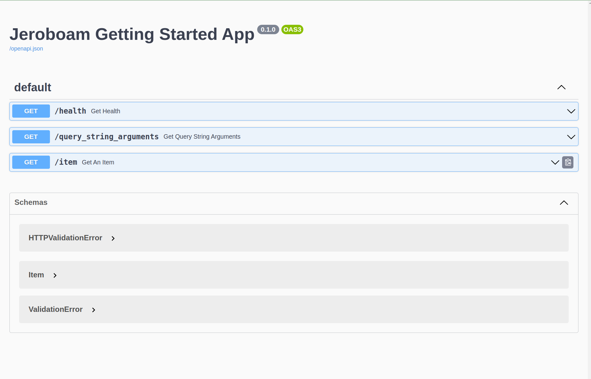

Guide de Démarrage
==================

Parcourons ensemble un exemple simple étape par étape.

Dans ce guide, nous allons:

- créer une application Jeroboam
- enregistrer une fonction de vue
- ajouter une configuration d'arguments de vue pour la validation des données entrantes
- ajouter un response_model à l'endpoint pour la validation des données sortantes
- enregistrer le blueprint OpenAPI pour consulter la documentation générée

Créer une Application Jeroboam
*******************************

Commençons par créer l'objet application.

.. literalinclude:: ../../docs_src/getting_started/01_create_app.py
    :linenos:
    :language: python
    :lines: 3-5
    :emphasize-lines: 1,3

Comme vous pouvez le voir, il n'y a rien de spécial dans la création de l'application à la ligne 3. La classe **Jeroboam** de flask_jeroboam sous-classe l'objet application `Flask <https://flask.palletsprojects.com/en/2.2.x/api/#application-object>`_ de Flask, et vous pouvez l'utiliser comme un remplacement direct de ce dernier.

.. literalinclude:: ../../docs_src/getting_started/01_create_app.py
    :linenos:
    :language: python
    :lines: 3-6
    :emphasize-lines: 4

À la ligne 4, nous appelons la méthode init_app de l'instance de l'application. Vous devez appeler cette méthode après avoir chargé la configuration de votre application: elle enregistrera les blueprints OpenAPI et les gestionnaires d'erreurs génériques. Vous pouvez toujours désactiver ces fonctionnalités avec les valeurs de configuration appropriées (voir :doc:`ici <features/configuration_fr>`).

.. literalinclude:: ../../docs_src/getting_started/01_create_app.py
    :linenos:
    :language: python
    :lines: 9-10
    :emphasize-lines: 1,2

Enfin, les lignes 8 et 9 sont un moyen pratique de démarrer l'application en exécutant le fichier directement.

.. note::
    Le modèle de fabrique d'application est généralement une bonne pratique `[1] <https://flask.palletsprojects.com/en/2.2.x/patterns/appfactories/>`_ et devrait être suivi lorsque vous démarrez un projet réel.

Enregistrer une fonction de vue
********************************

Enregistrer une fonction de vue signifie lier une fonction Python à une URL. Chaque fois qu'une requête envoyée à votre serveur correspond à la règle que vous avez définie, la fonction enregistrée, appelée fonction de vue, sera exécutée.

Vous pouvez enregistrer une fonction de vue de plusieurs manières dans Flask. La méthode préférée dans **Flask_Jeroboam** consiste à utiliser des décorateurs de méthode. Remarquez le décorateur surlignée dans le code ci-dessous:

.. literalinclude:: ../../docs_src/getting_started/02_register_view.py
    :linenos:
    :language: python
    :lines: 9-11
    :emphasize-lines: 1,2

Ici, nous indiquons à l'instance de l'application que lorsqu'elle reçoit une requête GET entrante vers l'URL ``/health``, elle doit appeler la fonction ``get_health`` et retourner le résultat au client. Essayons. Exécutez votre fichier et commencez à tester.

.. code-block:: bash

    $ curl http://localhost:5000/health
    {"status": "ok"}

.. note::
    Bien que vous puissiez enregistrer des fonctions de vue directement sur l'instance de l'application, tout projet au-delà de la taille d'un tutoriel classique bénéficiera de la modularité des Blueprints `[2] <https://flask.palletsprojects.com/en/2.2.x/blueprints/>`_, et vous vous retrouverez à utiliser des blueprints plus que votre instance d'application. La bonne nouvelle est que vous enregistrez les fonctions de vue sur les blueprints comme vous le faites sur l'instance de l'application.

Ajouter des Arguments de Vue
*****************************

Essayons quelque chose de plus intéressant. Jusqu'à présent, notre application Jeroboam se comporte comme une application Flask classique.

Enregistrons une fonction de vue qui prend des paramètres. Remarquez la définition surlignée de la fonction ci-dessous—elle montre une fonction de vue avec des annotations de type et des valeurs par défaut sur ses paramètres.

.. literalinclude:: ../../docs_src/getting_started/03_view_arguments.py
    :linenos:
    :language: python
    :lines: 9-11
    :emphasize-lines: 1,2

Le seul but de cette fonction de vue est de nous aider à inspecter les valeurs que la fonction reçoit réellement lorsqu'elle est appelée, et c'est précisément ce que nous allons faire.

.. code-block:: bash

    $ curl 'http://localhost:5000/query_string_arguments'
    {"page":1,"per_page":10}

Jusqu'ici, tout va bien. Le résultat était prévisible. La fonction a reçu les valeurs par défaut des paramètres. Essayons autre chose.

.. code-block:: bash

    $ curl 'http://localhost:5000/query_string_arguments?page=2&per_page=50'
    {"page":2,"per_page":50}

Regardons de plus près l'url que nous appelons: ``/query_string_arguments?page=2&per_page=50``. La partie après le ``?`` s'appelle une chaîne de requête. C'est un moyen de passer des paramètres via une URL. ``page=2&per_page=50`` se traduit par deux paramètres, ``page`` et ``per_page`` avec des valeurs respectives de ``2`` et ``50``. Heureusement, c'est exactement ce que notre fonction de vue attend. **Flask-Jeroboam** analysera la chaîne de requête, validera les valeurs (vérifiera qu'elles peuvent être converties en int) et les injectera dans la fonction de vue.

L'exemple précédent nous a montré la partie analyse et injection. Regardons ses capacités de validation en passant une valeur de page qui ne peut pas être convertie en int. Nous ajouterons l'option ``-w 'Status Code: %{http_code}\n'`` à notre commande curl pour afficher le code d'état de la réponse.

.. code-block:: bash

    $ curl -w 'Status Code: %{http_code}\n' 'http://localhost:5000/query_string_arguments?page=not_a_int&per_page=50'
    {"detail":[{"loc":["query","page"],"msg":"value is not a valid integer","type":"type_error.integer"}]}
    Status Code: 400

Ici, nous avons obtenu une réponse 400 Bad Request, avec des détails sur l'erreur, nous indiquant que la valeur de l'argument ``page`` situé dans la ``query`` (*"loc":["query","page"]*) n'est pas un entier valide (*"msg":"value is not a valid integer"*).

.. note::
    Par défaut, les arguments d'une fonction de vue ``GET`` sont censés obtenir leurs valeurs de la chaîne de requête. C'est leur ``location``. Vous pouvez définir explicitement l'emplacement des arguments en utilisant des fonctions d'argument comme valeurs par défaut (Exemple: ``page: int = Query(1)``). Les emplacements possibles pour les paramètres incluent ``Path``, ``Query``, ``Header`` et ``Cookie``. Pour les corps de requête, vous pouvez définir les emplacements sur ``Body``, ``Form`` et ``File``. ``Body`` est l'emplacement par défaut pour les requêtes ``POST`` et ``PUT``.

    Vous trouverez plus d'informations sur ce mécanisme :doc:`ici <features/inbound_fr>`.

Maintenant que nous avons couvert les bases de la gestion entrante, regardons l'analyse et la validation sortantes. Cela se fait en ajoutant un ``response_model`` à notre décorateur.

Modèles de Réponse
******************

Nous commençons par définir un BaseModel Pydantic pour la validation des réponses. Regardez les sections surlignées ci-dessous—les imports en haut et la définition du modèle ``Item`` avec ses trois champs.

.. literalinclude:: ../../docs_src/getting_started/04_response_models.py
    :linenos:
    :language: python
    :lines: 1-5,11-14
    :emphasize-lines: 1,3,6-8

Maintenant regardez l'endpoint surlignée qui utilise ce modèle. Le décorateur inclut ``response_model=Item``, et la fonction retourne seulement des données partielles :

.. literalinclude:: ../../docs_src/getting_started/04_response_models.py
    :linenos:
    :language: python
    :lines: 1-5,17-19
    :emphasize-lines: 1,3,6,7

Essayons.

.. code-block:: bash

    $ curl 'http://localhost:5000/item'
    {"name": "Bottle", "price": 5.0, "count": 1}%

Ce qui s'est passé, c'est que la valeur de retour de la fonction de vue a été transmise au modèle ``Item``. Le prix a été converti en float, et la paire clé-valeur manquante de count a été ajoutée avec sa valeur par défaut. Les valeurs ont été validées et enfin sérialisées en une chaîne JSON.

Enfin, pour conclure cette première visite de **Flask-Jeroboam**, regardons la documentation conforme à OpenAPI que notre application a pu produire.

Documentation OpenAPI
*********************

Lorsque vous visitez `<http://localhost:5000/docs>`_ dans votre navigateur, vous devriez voir la documentation OpenAPI de votre API. Elle ressemblera à quelque chose comme ceci:

Récapitulatif
*************

Dans cette page, nous avons couvert les trois principales fonctionnalités de **Flask-Jeroboam**:

- Analyse et validation des données entrantes basées sur les signatures de fonction de vue
- Validation et sérialisation des données sortantes basées sur les modèles de réponse
- Auto-documentation OpenAPI

Pour aller plus loin
********************

Si vous voulez en savoir plus, vous pouvez consulter notre :doc:`visite approfondie des fonctionnalités </fr/features/index_fr>`.

Nous avons également mentionné:

- `Fabriques d'Applications Flask <https://flask.palletsprojects.com/en/2.2.x/patterns/appfactories/>`_
- `Applications Modulaires Flask avec Blueprints <https://flask.palletsprojects.com/en/2.2.x/blueprints/>`_

Le code d'exemple complet pour cette page se trouve `ici <https://github.com/jcbianic/flask-jeroboam/tree/main/docs_src/getting_started_00.py>`_. Les exemples sont testés dans `ce fichier <https://github.com/jcbianic/flask-jeroboam/tree/main/tests/test_docs/test_getting_started.py>`_.
