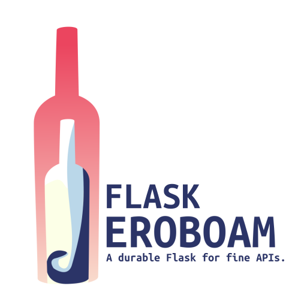

.. rst-class:: hide-header

Bienvenue
=========

Bienvenue dans la documentation de **Flask-Jeroboam**.

**Flask-Jeroboam** est une extension `Flask`_ inspirée par `FastAPI`_. Elle utilise `Pydantic`_
pour fournir une validation de données facile à configurer dans l'analyse des requêtes et la sérialisation des réponses, ainsi que
la génération automatique de la documentation conforme à OpenAPI.

**Flask-Jeroboam** vous permet de profiter de la syntaxe élégante de FastAPI tout en restant dans l'écosystème de Flask.
C'est parfait pour les développeurs qui adorent l'approche type-safe de FastAPI mais doivent travailler avec des applications Flask existantes
ou préfèrent la maturité et l'écosystème étendu de Flask.

Commencez par :doc:`l'installation <installation_fr>`, puis plongez-vous directement dans notre :doc:`Guide de démarrage <getting_started_fr>`. Ensuite, la
:doc:`Visite détaillée des fonctionnalités <features/index_fr>` approfondit comment utiliser l'extension, tandis que le
:doc:`Tutoriel <tutorial/index_fr>` vous guide à travers un exemple complet. Enfin, la section :doc:`API <api/index_fr>` vous donne les détails sur les internals de l'extension.

.. note::
   Cette documentation suppose une certaine familiarité avec `Flask`_ et `Pydantic`_. Si vous êtes nouveau dans l'un ou l'autre, veuillez consulter leur documentation respective.
   Elles sont toutes deux fantastiques.

   - `Documentation de Flask <https://flask.palletsprojects.com/>`_
   - `Documentation de Pydantic <https://docs.pydantic.dev/>`_

.. _Flask: https://www.palletsprojects.com/p/flask/
.. _Pydantic: https://docs.pydantic.dev/
.. _FastAPI: https://fastapi.tiangolo.com/

Guide de l'utilisateur
----------------------

Ce guide vous montrera comment utiliser Flask-Jeroboam.

.. toctree::
   :maxdepth: 2
   :titlesonly:

   installation_fr
   getting_started_fr
   features/index_fr
   tutorial/index_fr
   guides/index_fr
   concepts/index_fr
   ../alternatives_fr

Référence API
-------------

Si vous cherchez des informations sur une fonction, classe ou
méthode spécifique, cette partie de la documentation est pour vous.

.. toctree::
   :maxdepth: 2

   api/index_fr
   reference/index_fr

Notes supplémentaires
---------------------

.. toctree::
   :maxdepth: 2
   :titlesonly:

   contributing_fr
   codeofconduct_fr
   license_fr
   changes_fr
