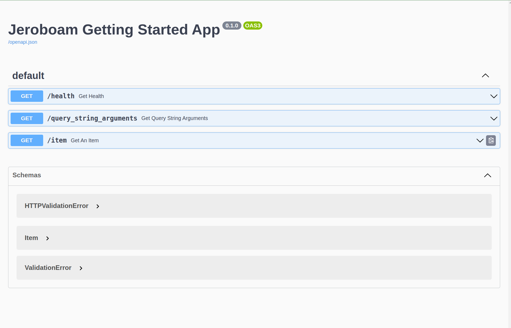

Getting Started
===============

Let's walk you through a simple example step by step.

In this guide, we will:

- create a Jeroboam app
- register a view function
- add some view argument configuration to it for inbound data validation
- add a response_model to the endpoint for outbound data validation
- register the OpenAPI blueprint to get a look at the generated documentation

Create a Jeroboam App
*********************

Let's start with creating the application object.

.. literalinclude:: ../docs_src/getting_started_00.py
    :linenos:
    :language: python
    :lines: 5-11,33-
    :emphasize-lines: 1,4

As you can see, there is nothing special about the app creation on line 4. The **Jeroboam** class from flask_jeroboam subclasses flask's `Flask <https://flask.palletsprojects.com/en/2.2.x/api/#application-object>`_ application object, and you can use it as a drop-in replacement of the former.

.. literalinclude:: ../docs_src/getting_started_00.py
    :linenos:
    :language: python
    :lines: 5-11,33-
    :emphasize-lines: 5

On line 5, we are calling the init_app method of the app instance. You should call this method after loading the configuration to your app: it will register OpenAPI blueprints and generic error handlers. You can always opt-out of these with appropriate configuration values (see :doc:`here <features/configuration>`).

.. literalinclude:: ../docs_src/getting_started_00.py
    :linenos:
    :language: python
    :lines: 5-11,33-
    :emphasize-lines: 8,9

Finally, lines 8 and 9 are a convenient way to start the app by running the file directly.

.. note::
    The application factory pattern is usually a good practice `[1] <https://flask.palletsprojects.com/en/2.2.x/patterns/appfactories/>`_ and should be followed when you start an actual project.

Register a view function
************************

Registering a view function means binding a python function to an URL. Whenever a request sent to your server matches the rule you defined, the registered function, called a view function, will be run.

You can register a view function in several ways in Flask. The preferred way to do it in **Flask_Jeroboam** is to use method decorators, like on line 8 in the example below:

.. literalinclude:: ../docs_src/getting_started_00.py
    :linenos:
    :language: python
    :lines: 5-15,33-
    :emphasize-lines: 8

Here we are telling the app instance that when it receives an incoming GET Request to the URL ``/health``, it should call the ``get_health`` function and return the result to the client. Let's try it. Run your file and start poking.

.. code-block:: bash

    $ curl http://localhost:5000/health
    {"status": "ok"}

.. note::
    Although you can register view functions directly on the app instance, any project beyond the size of a classical tutorial will benefit from using the modularity of Blueprints `[2] <https://flask.palletsprojects.com/en/2.2.x/blueprints/>`_, and you will find yourself using blueprints more than your app instance. The good news is that you register view functions on blueprints as you do on the app instance.

Adding View Arguments
*********************

Let's try something more interesting. So far, our Jeroboam application behaves like a regular Flask application.

Let's register a view function that takes parameters. On line 13, you will find the method decorator we saw in the previous section. But on line 14, the view function takes two parameters with type hints and default values. It then returns them without modifying them.

.. literalinclude:: ../docs_src/getting_started_00.py
    :linenos:
    :language: python
    :lines: 5-21,33-
    :emphasize-lines: 14

This view function 's only purpose is to help us inspecting the values the function actually receives when it is called and this is precisely what we will do.

.. code-block:: bash

    $ curl 'http://localhost:5000/query_string_arguments'
    {"page":1,"per_page":10}

So far, so good. The result was predictable. The function received the default values for the parameters. Let's try something else.

.. code-block:: bash

    $ curl 'http://localhost:5000/query_string_arguments?page=2&per_page=50'
    {"page":2,"per_page":50}

Let's take a closer look at the url we're hitting: ``/query_string_arguments?page=2&per_page=50``. The part after the ``?`` is called a query string. It is a way to pass parameters through a URL. ``page=2&per_page=50`` translates to two parameters, ``page`` and ``per_page`` with respective values of ``2`` and ``50``. Luckily that's exactly what our view function is expecting.  **Flask-Jeroboam** will parse the query string, validate the values (check they can be cast as int) and inject them into the view function.

The previous example showed us the parsing and injecting part. Let's take a look at its validation capabilities by passing a page value that can't be cast to an int. We will add the ``-w 'Status Code: %{http_code}\n'`` option to our curl command to print the status code of the response.

.. code-block:: bash

    $ curl -w 'Status Code: %{http_code}\n' 'http://localhost:5000/query_string_arguments?page=not_a_int&per_page=50'
    {"detail":[{"loc":["query","page"],"msg":"value is not a valid integer","type":"type_error.integer"}]}
    Status Code: 400

Here, we got a 400 Bad Request response, with details about the error, telling us that the value of the ``page`` argument located in the ``query`` (*"loc":["query","page"]*) is not a valid integer (*"msg":"value is not a valid integer"*).

.. note::
    By default, the arguments of a ``GET`` view function are expected to get their values from the query string. It is their ``location``. You can explicitly set the location of the arguments by using argument functions as default values (Exemple: ``page: int = Query(1)``). Possible location for parameters include ``Path``, ``Query``, ``Header`` and ``Cookie``. For request bodies, you can set locations to ``Body``, ``Form`` and ``File``. ``Body`` is the default location for ``POST`` and ``PUT`` requests.

    You will find more information about this mechanics :doc:`here <features/inbound>`.

Now that we have covered the basics of inbound handling, let's look at the outbound parsing and validation. This is done by adding a ``response_model`` to our decorator.

Response Models
***************

We start by defining a Pydantic BaseModel for our response. This model will be used to validate the outbound data of our view function. We first import BaseModel and Field from pydantic on line 1 and 2. On line 11-14, we define a subclass of pydnatic's BaseModel named ``Item`` with three fields: ``name``, ``price`` and ``count``. The ``name`` field is a string, the ``price`` field is a float and the ``count`` field is an int with a default value of 1.

.. literalinclude:: ../docs_src/getting_started_00.py
    :linenos:
    :language: python
    :lines: 2-11,22-
    :emphasize-lines: 1,2,11-14

We then pass the ``Item`` model as the ``response_model`` argument of the ``@app.get`` decorator on line 17. Our view function's purpose is to demonstrate that our return value will be processed through the ``Item`` model and not simply returning the ``{"name": "Bottle", "price": 5}`` dictionnary, casting the price into a float, and adding a default value of 1 to the count field.

.. literalinclude:: ../docs_src/getting_started_00.py
    :linenos:
    :language: python
    :lines: 2-11,22-
    :emphasize-lines: 17

Let's try it out.

.. code-block:: bash

    $ curl 'http://localhost:5000/item'
    {"name": "Bottle", "price": 5.0, "count": 1}%

What happened is that the return value of the view function has been fed to the ``Item`` model. The price have been casted as a float, and the missing key-value of count has been added with its default value. The values have been validated and finally serialized into a JSON string.

Finally, to wrap up this first tour of **Flask-Jeroboam**, let's take a look at the OpenAPI-complaint documentation our app was able to produce.

OpenAPI Documentation
*********************

When you visit `<http://localhost:5000/docs>`_ in your browser you should see the OpenAPI documentation for your API. It will look something like this:

Wrapping Up
***********

In this page, we covered the three main features of **Flask-Jeroboam**:

- Inbound data parsing and validation based on view function signatures
- Outbound data validation and serialization based on response models
- OpenAPI auto-documentation

To go further
*************

If you want to learn more, you can check out our :doc:`in-depth features tour </features/index>`.

We also mentioned:

- `Flask's App Factories <https://flask.palletsprojects.com/en/2.2.x/patterns/appfactories/>`_
- `Flask's Modular App with Blueprints <https://flask.palletsprojects.com/en/2.2.x/blueprints/>`_

Complete example code for this page can be found `here <https://github.com/jcbianic/flask-jeroboam/tree/main/docs_src/getting_started_00.py>`_. Examples are tested in  `this file <https://github.com/jcbianic/flask-jeroboam/tree/main/tests/test_docs/test_getting_started.py>`_.
