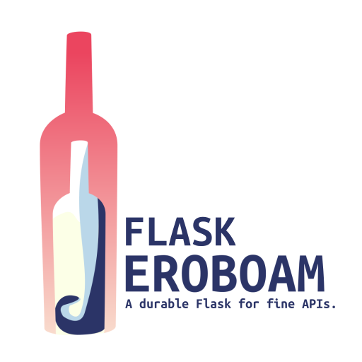

.. rst-class:: hide-header

Welcome
=======

Welcome to **Flask-Jeroboam**'s documentation.

**Flask-Jeroboam** is a `Flask`_ extension modelled after `FastAPI`_. Like the former, it uses `Pydantic`_
to provide easy-to-configure data validation in request parsing and response serialization, as well as
OpenAPI-compliant documentation auto-generation.

Start with :doc:`installation`, then jump right in with our :doc:`Getting Started Guide </getting_started>`. Next, the
:doc:`In-depth Features Tour </features/index>` dive deep into how to use the extension, while the
:doc:`Tutorial </tutorial/index>` walks you through a comprehensive example. Finally, the :doc:`API </api/index>` section gives you details on the extension's internals.

.. note::
   This documentation assumes a certain familiarity with `Flask`_ and `Pydantic`_. If you're new to either, please refer to their respective documentation.
   They are both fantastic.

   - `Flask documentation <https://flask.palletsprojects.com/>`_
   - `Pydantic documentation <https://docs.pydantic.dev/>`_

.. _Flask: https://www.palletsprojects.com/p/flask/
.. _Pydantic: https://docs.pydantic.dev/
.. _FastAPI: https://fastapi.tiangolo.com/

User's Guide
------------

This guide will walk you through how to use Flask-Jeroboam.

.. toctree::
   :maxdepth: 2
   :titlesonly:

   installation
   getting_started
   features/index
   tutorial/index

API Reference
-------------

If you are looking for information on a specific function, class or
method, this part of the documentation is for you.

.. toctree::
   :maxdepth: 2

   api/index

Additional Notes
----------------

.. toctree::
   :maxdepth: 2
   :titlesonly:

   contributing
   codeofconduct
   license
   changes
